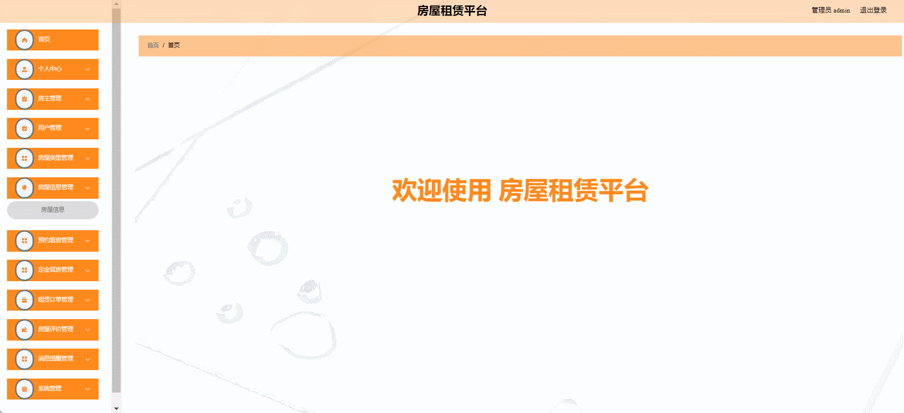
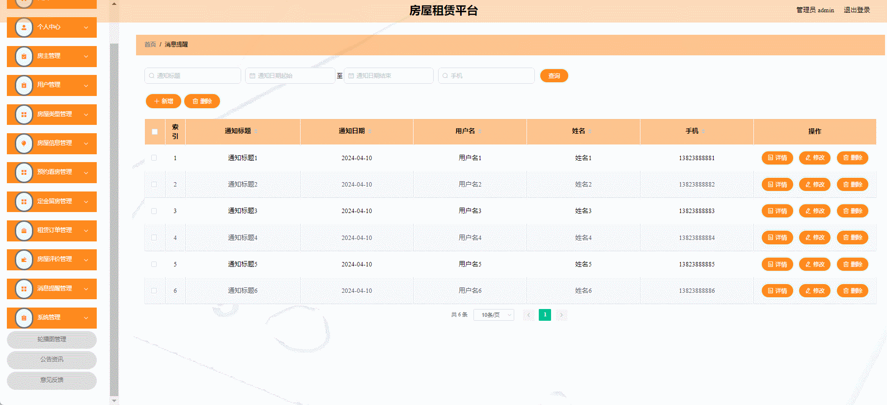

# lease-houses🎂

基于SpringBoot+Vue的房租租赁平台

## 介绍🌞

> 开发此系统，就是希望能帮助用户解决租房的困扰，依托于网上租房更直观的让房主和求租人互相交流让租房变得更简单直观，节省线下走动时间的同时也能避免一些因为中介不透明管理带来的问题，更快的帮助大家租到自己满意的房子，提高大家的生活质量。

## 项目演示🌞

> 用户端


.gif)

> 管理端





## 安装教程🌞

```
1. 运行环境准备mysql8 + java8 + node14.16.1

2. 配置maven路径，加载依赖

3. 运行sql文件，确保application.yml或config.properties的数据库名称和账号密码是数据库所在主机的账号密码
```


## 使用说明🌞

```
1. 登入

    管理员账号：admin	密码：123456

    房东账号： zhangayi 密码：123456

    客户账号：zhangsan	密码：123456
  
2. 运行流程

SpringBoot+Vue项目的部署详情可以查看这篇CSDN博客：http://t.csdnimg.cn/kpuxS

前后端不分离项目的部署流程可以查看这篇CSDN博客：http://t.csdnimg.cn/CslA5
```


## CSDN项目合集🌞

点击前往：http://t.csdnimg.cn/Q4u84


## 联系我🌞

**有偿获取完整源码或调试代码**

🐧：1902317191

微信：


